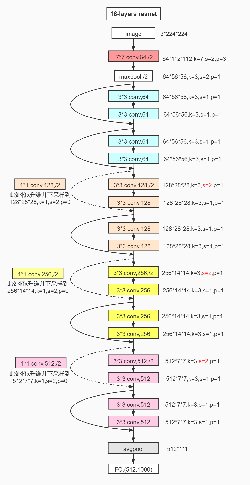
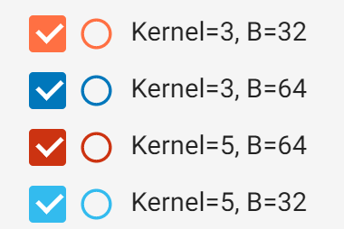
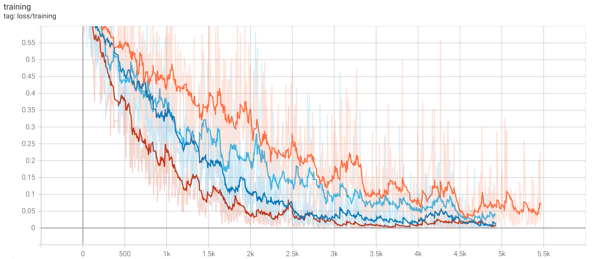
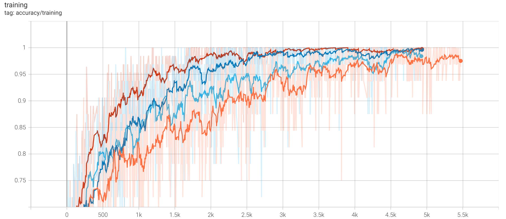

# 基于Pytorch的ResNet18猫狗图像分类
数据集可在[此处](https://link.zhihu.com/?target=https%3A//pan.baidu.com/s/1QG6nUcHx0QDRrFWw2bcTJg)下载获得，提取码：`p96v`，解压后将文件夹命名为data，放置于项目目录下。

## ResNet18模型结构如下：

## 1.数据预处理
`dataset.py`文件，包括对图像数据resize、标准化、分割训练/验证/测试集。

## 2.模型定义
可运行`model.py`文件模拟模型forward过程，若想调整中间层的卷积核大小，要注意连同padding值一并调整。

## 3.训练/测试
运行`main.py`开始模型训练，或输入已有**模型参数文件**（注意，不是模型文件）的路径进行测试，按程序提示进行训练。

## 4.查看loss曲线与accuracy曲线
可以看到调整batch_size和kernel大小对训练的影响

